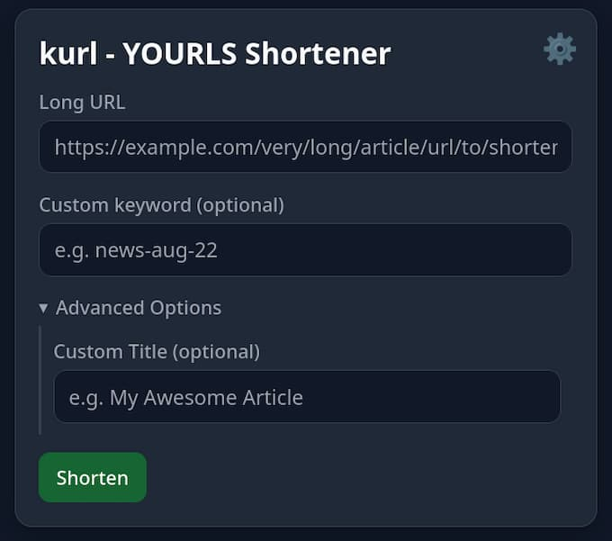

# kurl - YOURLS Shortener for Firefox

A Firefox add-on to shorten URLs with your self-hosted YOURLS instance.

## Features

* **Quickly shorten links**: Create short URLs for any website directly from your browser.
* **Universal Link Cleaning**: Automatically finds the real destination URL from tracking links (Google, Bing, etc.) before shortening.
* **Custom Keywords & Titles**: Assign optional custom keywords and titles to your short links for easy management.
* **QR Code Generation**: Instantly generate and download a high-quality QR code for any short URL.
* **Instance Dashboard**: View your YOURLS instance's total links and clicks at a glance.
* **Full Link Management**: Check the click count and target URL for any existing short link, or delete it directly from the add-on.
* **Streamlined Workflow**: Use the toolbar button, right-click context menu, or a keyboard shortcut (`Ctrl+Shift+K`).
* **Privacy-Focused**: Connects only to your own YOURLS instance. No data is sent to third parties.
* **Multi-language Support**: Available in English, German, French, Spanish, and many more languages.

## About YOURLS (Your Own URL Shortener)

YOURLS is a free, open-source set of PHP scripts that allows you to run your own URL shortening service. Unlike commercial services, YOURLS gives you full control over your data, with powerful features like detailed statistics, link management, and a plugin architecture to extend its functionality.

This Firefox add-on requires you to have your own YOURLS instance already installed and running on a web server.

### How to Install YOURLS

Self-hosting YOURLS requires a web server with PHP and a MySQL database. The general steps are:
1.  Download the latest version of YOURLS from their official website.
2.  Unzip the files and upload them to your web server.
3.  Create a MySQL database and a user for it.
4.  Configure the `config.php` file with your database details, site URL, and a secure signature token.
5.  Run the installation script by navigating to `http://your-domain.com/admin/` in your browser.

For complete and detailed instructions, please refer to the official guide:
**[Official YOURLS Installation Guide](https://yourls.org/#Install)**

### Finding Your API Signature Token

To connect this add-on to your YOURLS instance, you need your unique API signature token.
1.  Log in to your YOURLS admin dashboard (e.g., `http://your-domain.com/admin/`).
2.  In the top menu, click on **Tools**.
3.  At the very top of the Tools page, you will find a section titled **"Secure passwordless API call"**. Your API signature token is the long string of characters displayed there.

## Installation

There are two ways to install **kurl**:

### 🔹 Option 1: Install from Firefox Add-ons

Once the add-on is approved, you can install it directly from the official Firefox Add-ons store:

Click **“Add to Firefox”** and follow the prompts.

### 🔹 Option 2: Manual Installation (for development)

1.  Go to the [**Releases Page**](https://github.com/gerald-drissner/kurl-firefox-addon/releases).  
2.  Download the `.zip` file from the latest release.  
3.  In Firefox, go to `about:addons`.  
4.  Click the gear icon (⚙️) and select **"Install Add-on From File..."**.  
5.  Select the downloaded `.zip` file.

## Usage

Before first use, you must configure the add-on. Right-click the kurl icon in your toolbar and select "Manage Extension," then go to the "Preferences" tab. You will need to enter your **YOURLS instance URL** and your **API signature token**.

There are three ways to use the shortener:
1.  **Toolbar Button**: Click the "kurl" icon in the Firefox toolbar to shorten the current page's URL.
2.  **Context Menu**: Right-click on a page, a link, or selected text to see shortening options.
3.  **Keyboard Shortcut**: Press **`Ctrl+Shift+K`** to open the popup for the current page.

## Privacy Policy

kurl communicates directly with the YOURLS instance URL that you configure in the add-on's settings. It does not collect, store, or transmit any data to any other third-party servers.

## License

This project is licensed under the MIT License. See the [LICENSE](LICENSE) file for details.
